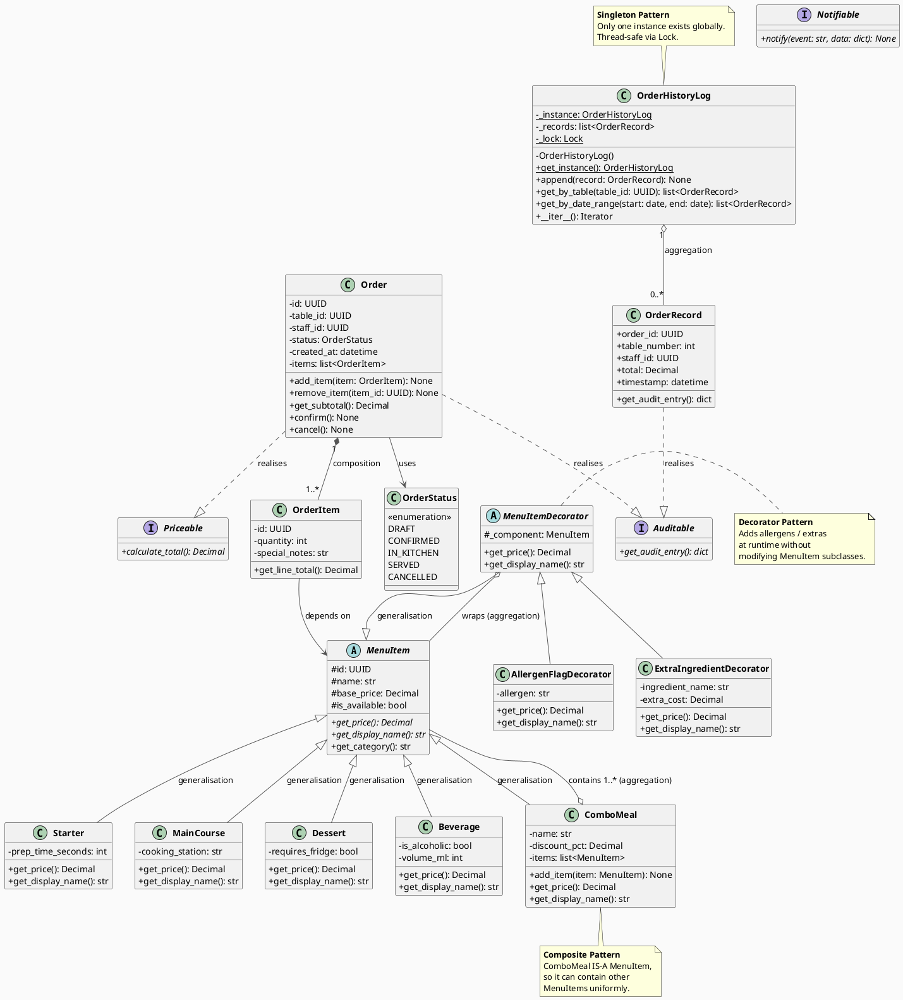
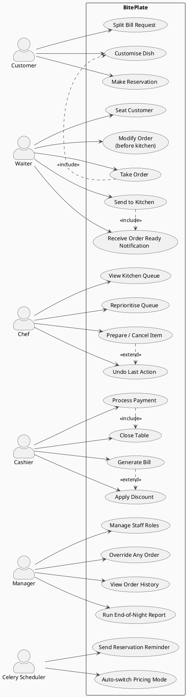
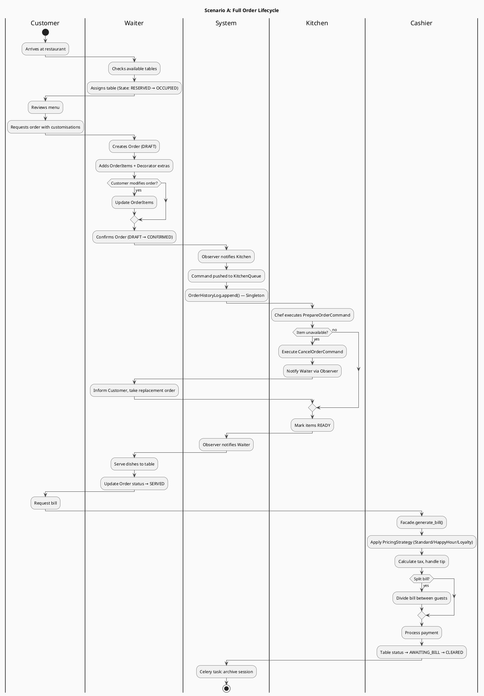
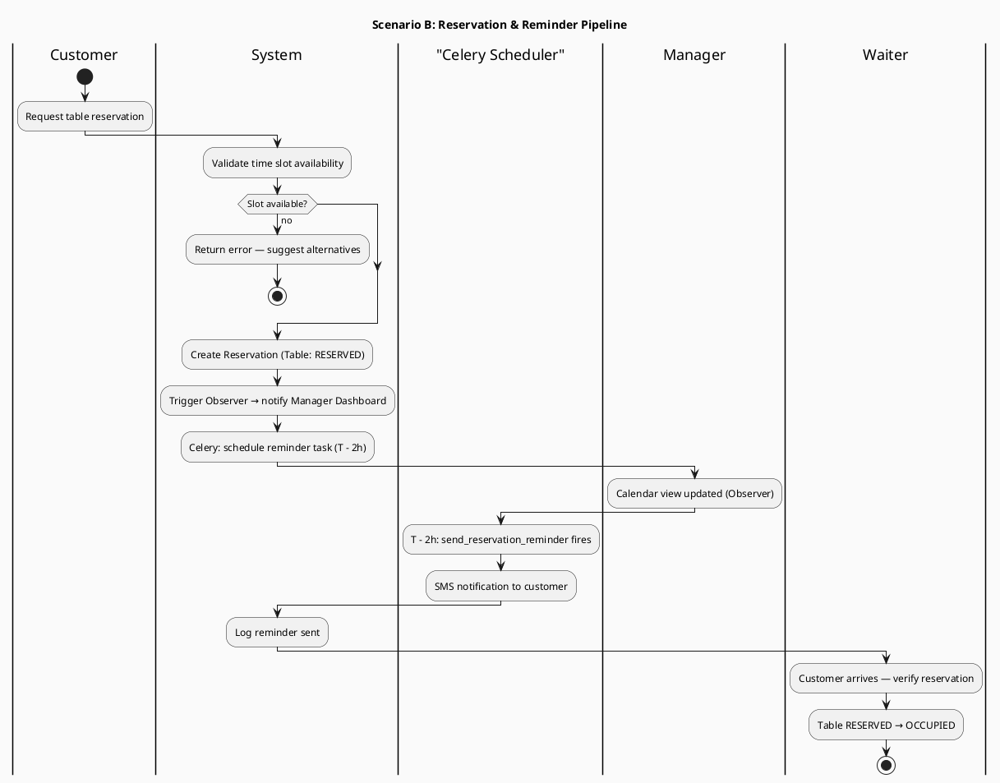
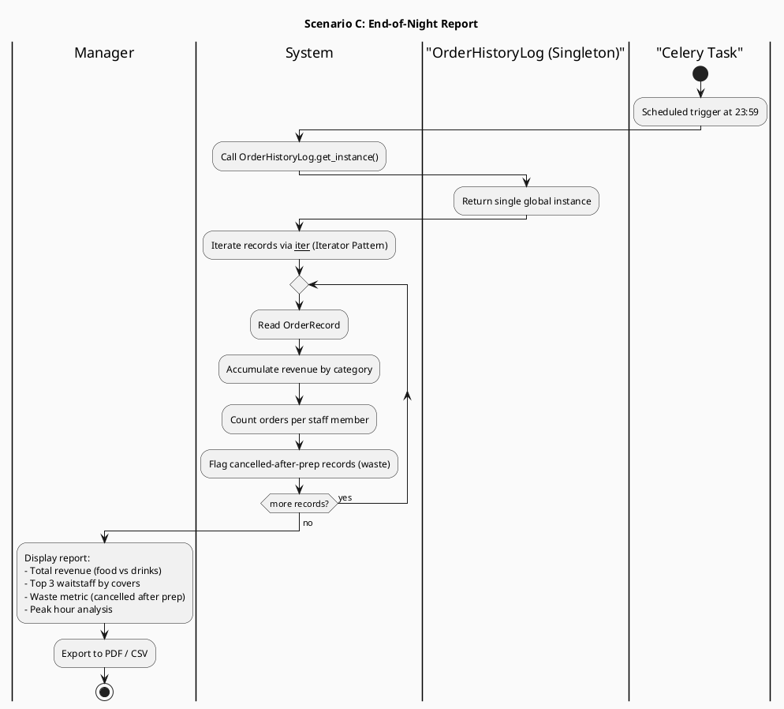
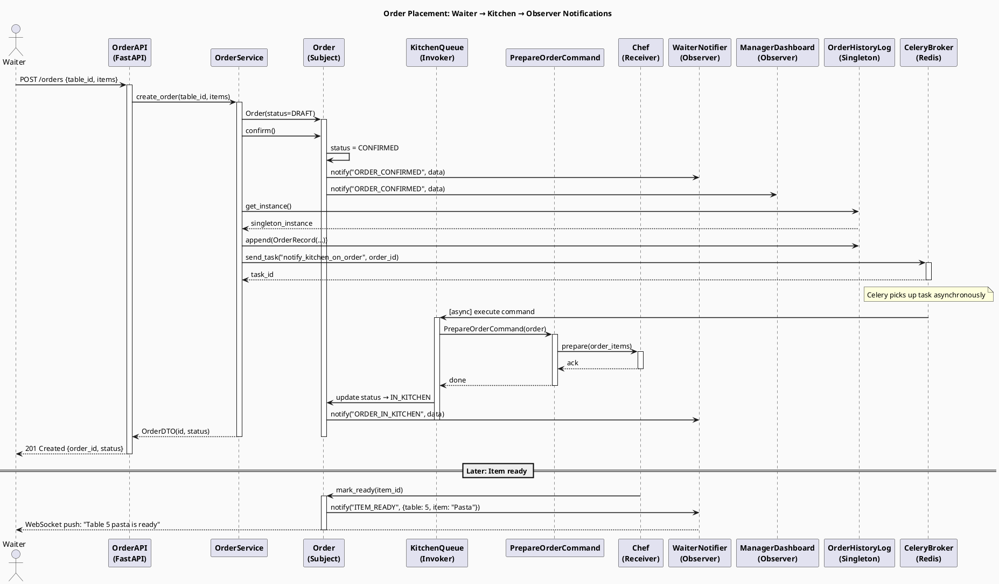

# BitePlate — UML Diagrams

> All diagrams use PlantUML syntax. Render at https://plantuml.com/plantuml or VS Code PlantUML extension.

---

## Diagram 1: UML Class Diagram — `orders` + `menu` Modules

Demonstrates: **Encapsulation**, **Inheritance**, **Polymorphism**, **Abstraction**, **Composition**, **Aggregation**, **Dependency**, **Realisation**, **Generalisation**

---

## Diagram 2: Use Case Diagram

---

## Diagram 3: Activity Diagrams (3 Scenarios)

### Scenario A — Full Order Lifecycle (Customer → Bill Settled)

### Scenario B — Reservation & Reminder Pipeline

### Scenario C — End-of-Night Report (Iterator + Singleton)

---

## Diagram 4: Sequence Diagram — Order Placement Flow

---

## Rendering Instructions

| Tool | How |
|------|-----|
| **VS Code** | Install "PlantUML" extension → right-click → Preview |
| **Online** | Go to https://www.plantuml.com/plantuml/uml → paste code |
| **CLI** | `java -jar plantuml.jar diagrams.md` |
| **Docker** | `docker run -p 8080:8080 plantuml/plantuml-server` |
